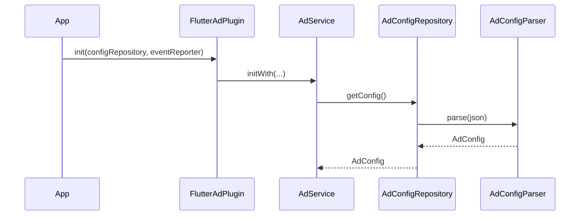
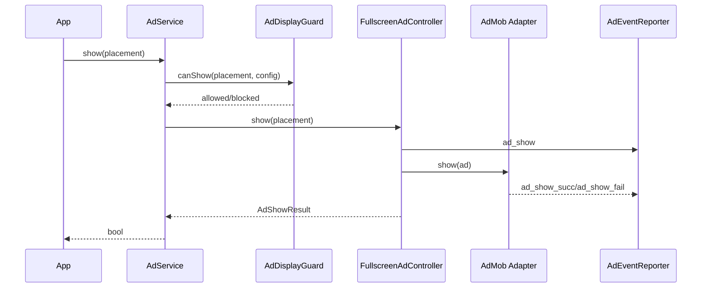
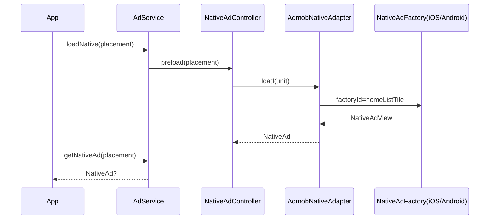

# 时序图

## 初始化与配置解析

```mermaid
sequenceDiagram
  participant App
  participant Plugin as FlutterAdPlugin
  participant Service as AdService
  participant Repo as AdConfigRepository
  participant Parser as AdConfigParser

  App->>Plugin: init(configRepository, eventReporter)
  Plugin->>Service: initWith(...)
  Service->>Repo: getConfig()
  Repo->>Parser: parse(json)
  Parser-->>Repo: AdConfig
  Repo-->>Service: AdConfig
```

## 全屏广告展示

```mermaid
sequenceDiagram
  participant App
  participant Service as AdService
  participant Guard as AdDisplayGuard
  participant Full as FullscreenAdController
  participant Adapter as AdMob Adapter
  participant Reporter as AdEventReporter

  App->>Service: show(placement)
  Service->>Guard: canShow(placement, config)
  Guard-->>Service: allowed/blocked
  Service->>Full: show(placement)
  Full->>Reporter: ad_show
  Full->>Adapter: show(ad)
  Adapter-->>Reporter: ad_show_succ/ad_show_fail
  Full-->>Service: AdShowResult
  Service-->>App: bool
```

## 原生广告

```mermaid
sequenceDiagram
  participant App
  participant Service as AdService
  participant Native as NativeAdController
  participant Adapter as AdmobNativeAdapter
  participant Factory as NativeAdFactory(iOS/Android)

  App->>Service: loadNative(placement)
  Service->>Native: preload(placement)
  Native->>Adapter: load(unit)
  Adapter->>Factory: factoryId=homeListTile
  Factory-->>Adapter: NativeAdView
  Adapter-->>Native: NativeAd
  App->>Service: getNativeAd(placement)
  Service-->>App: NativeAd?
```
