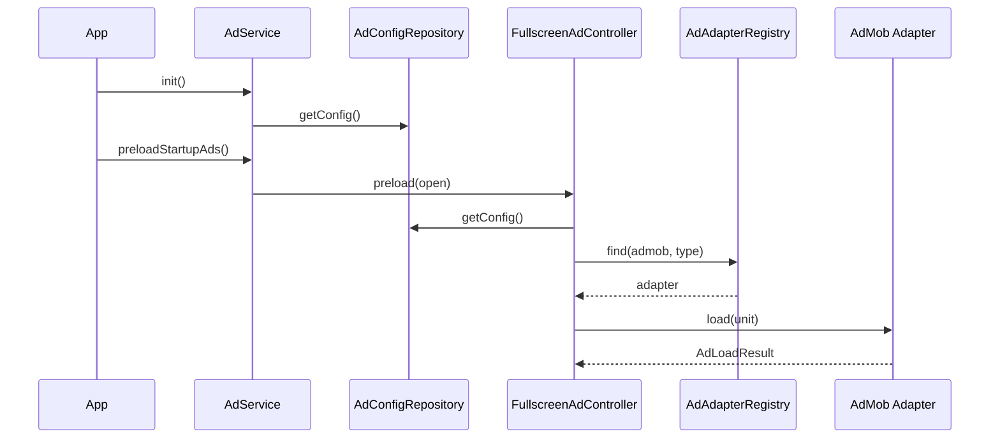
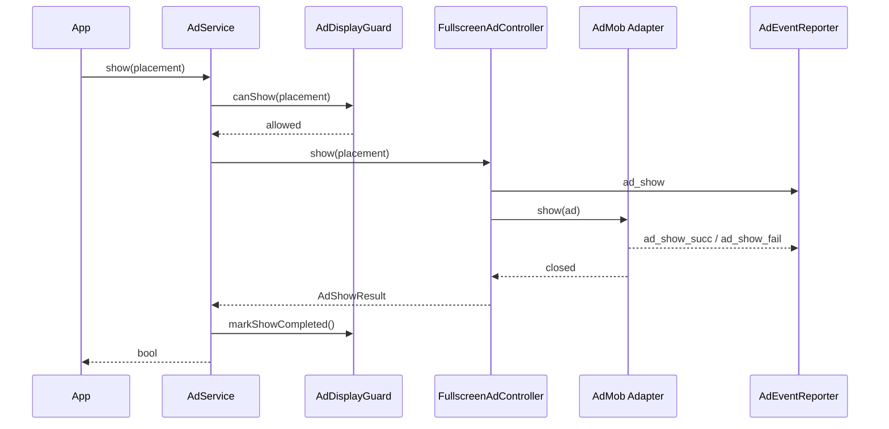
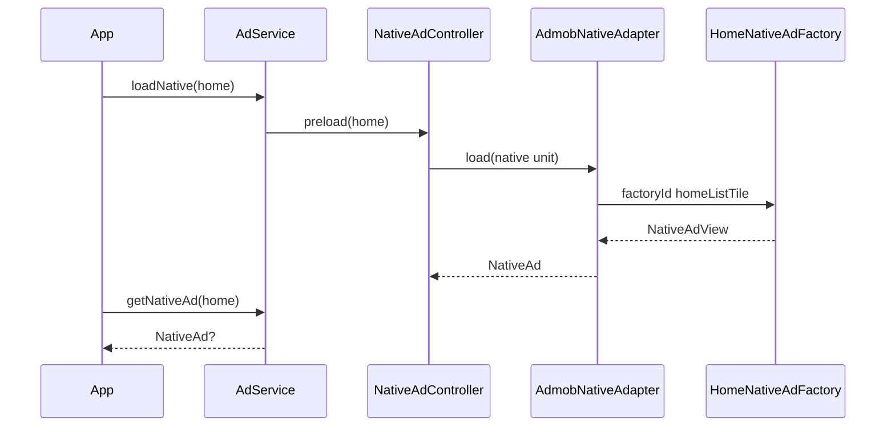

# 广告时序

## 启动预加载

```mermaid
sequenceDiagram
  participant App
  participant Service as AdService
  participant Repo as AdConfigRepository
  participant Controller as FullscreenAdController
  participant Registry as AdAdapterRegistry
  participant Adapter as AdMob Adapter

  App->>Service: init()
  Service->>Repo: getConfig()
  App->>Service: preloadStartupAds()
  Service->>Controller: preload(open)
  Controller->>Repo: getConfig()
  Controller->>Registry: find(admob, type)
  Registry-->>Controller: adapter
  Controller->>Adapter: load(unit)
  Adapter-->>Controller: AdLoadResult
```

## 全屏展示

```mermaid
sequenceDiagram
  participant App
  participant Service as AdService
  participant Guard as AdDisplayGuard
  participant Controller as FullscreenAdController
  participant Adapter as AdMob Adapter
  participant Reporter as AdEventReporter

  App->>Service: show(placement)
  Service->>Guard: canShow(placement)
  Guard-->>Service: allowed
  Service->>Controller: show(placement)
  Controller->>Reporter: ad_show
  Controller->>Adapter: show(ad)
  Adapter-->>Reporter: ad_show_succ / ad_show_fail
  Adapter-->>Controller: closed
  Controller-->>Service: AdShowResult
  Service->>Guard: markShowCompleted()
  Service-->>App: bool
```

## 原生广告

```mermaid
sequenceDiagram
  participant App
  participant Service as AdService
  participant Native as NativeAdController
  participant Adapter as AdmobNativeAdapter
  participant Android as HomeNativeAdFactory

  App->>Service: loadNative(home)
  Service->>Native: preload(home)
  Native->>Adapter: load(native unit)
  Adapter->>Android: factoryId homeListTile
  Android-->>Adapter: NativeAdView
  Adapter-->>Native: NativeAd
  App->>Service: getNativeAd(home)
  Service-->>App: NativeAd?
```
